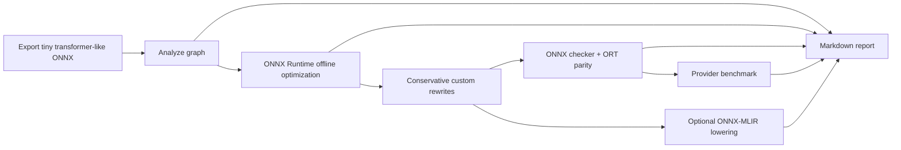

# transformer-compiler-workbench

[](https://github.com/KOKOSde/transformer-compiler-workbench/actions/workflows/ci.yml)

`transformer-compiler-workbench` is a CPU-first ONNX/MLIR workbench for
studying how transformer inference graphs change through analysis, ONNX Runtime
optimization, conservative graph rewrites, validation, and optional ONNX-MLIR
lowering.

It is not a replacement for ONNX Runtime, ONNX Runtime transformer optimizer,
Hugging Face Optimum, NVIDIA ONNX GraphSurgeon, or ONNX-MLIR. The goal is to
connect compiler tools into a clear research workflow and make graph changes
visible, testable, and reproducible.

The NVIDIA LPX-specific positioning is in
[docs/NVIDIA_LPX_ALIGNMENT.md](docs/NVIDIA_LPX_ALIGNMENT.md).

An NVIDIA GPU validation run from a Vast instance is recorded in
[docs/VAST_GPU_RESULTS.md](docs/VAST_GPU_RESULTS.md). It includes the root cause
for the original tiny-graph GPU result and a larger standard-ONNX benchmark
showing `CUDAExecutionProvider` as the effective provider.

## Architecture



## Quickstart

```bash
python3 -m venv .venv
source .venv/bin/activate
python -m pip install -e ".[dev]"

python -m tcw export --model distilbert-base-uncased --out artifacts/model.onnx
python -m tcw analyze artifacts/model.onnx --out reports/baseline.json
python -m tcw optimize artifacts/model.onnx --out artifacts/model.opt.onnx --report reports/opt.json --sample-inputs artifacts/model.inputs.npz
python -m tcw validate artifacts/model.onnx artifacts/model.opt.onnx --out reports/validate.json --sample-inputs artifacts/model.inputs.npz
python -m tcw benchmark artifacts/model.onnx artifacts/model.opt.onnx artifacts/model.opt.ort.onnx --labels Original Custom ORT --sample-inputs artifacts/model.inputs.npz --providers CPUExecutionProvider --out reports/benchmark.json
python -m tcw lower artifacts/model.opt.onnx --emit-dir artifacts/mlir
cp artifacts/mlir/lowering.json reports/lowering.json
python -m tcw report --reports reports --out reports/index.md
```

Or run the full workflow:

```bash
scripts/reproduce.sh
```

The MVP export command writes a deterministic tiny transformer-like ONNX graph.
It intentionally avoids model downloads so the first workflow works on macOS
CPU. The graph uses standard ONNX operators and includes attention-like,
MatMul/Add, GELU-like, LayerNorm-like, Identity, and canceling Transpose
patterns for analysis and rewrite experiments.

For provider benchmarking, export a larger deterministic graph:

```bash
python -m tcw export --preset benchmark --out artifacts/benchmark.onnx
python -m tcw optimize artifacts/benchmark.onnx --out artifacts/benchmark.opt.onnx --report reports/benchmark.opt.json --sample-inputs artifacts/benchmark.inputs.npz
python -m tcw benchmark artifacts/benchmark.onnx artifacts/benchmark.opt.onnx artifacts/benchmark.opt.ort.onnx \
  --labels Original Custom ORT \
  --sample-inputs artifacts/benchmark.inputs.npz \
  --providers CPUExecutionProvider \
  --out reports/benchmark.json \
  --warmup 10 \
  --runs 50
```

On a machine with a working `onnxruntime-gpu` install, add
`CUDAExecutionProvider` to `--providers`. The benchmark JSON records available
providers and the effective session providers for each latency row, so fallback
to CPU is visible.

## Example Report

The checked-in example report is generated by `scripts/reproduce.sh` and lives
at [reports/index.md](reports/index.md). The default graph is intentionally
small so it runs quickly on macOS/CPU.

| Graph | Nodes | Cast | Transpose | Reshape | CPU latency p50 | Max output diff |
|---|---:|---:|---:|---:|---:|---:|
| Original | 51 | 0 | 3 | 0 |  | 0 |
| ORT optimized | 31 | 0 | 1 | 12 | 0.019 ms | 0 |
| Custom optimized | 48 | 0 | 1 | 0 | 0.018 ms | 0 |

The same default report records the effective CPU provider for the tiny graph:

| Provider | Graph | Effective provider | p50 latency | Parity vs first graph |
|---|---|---|---:|---|
| CPUExecutionProvider | Original | True | 0.016 ms | True |
| CPUExecutionProvider | Custom | True | 0.020 ms | True |
| CPUExecutionProvider | ORT | True | 0.019 ms | True |

The larger Vast benchmark uses the `benchmark` preset and records real CPU vs
CUDA provider measurements in
[reports/benchmark.vast.json](reports/benchmark.vast.json):

| Graph | Nodes | CPU p50 | CUDA p50 | CUDA speedup vs CPU |
|---|---:|---:|---:|---:|
| Original | 204 | 14.020 ms | 0.512 ms | 27.36x |
| Custom rewrites | 192 | 13.741 ms | 0.516 ms | 26.64x |
| ORT optimized | 124 | 13.998 ms | 0.515 ms | 27.16x |

The default report is CPU-first. GPU rows are only meaningful when the JSON
shows `CUDAExecutionProvider` as an effective session provider.

The report also emits SVG visualizations under `reports/assets/`, including the
compiler workflow, node-count changes, custom pass effects, ORT op deltas, and
provider latency bars when benchmark data exists.

## Supported Rewrites

All rewrite passes are conservative and must pass `onnx.checker` plus ONNX
Runtime output parity tests.

- Remove `Identity` nodes by rewiring uses.
- Remove inference `Dropout` when the mask output is unused and no
  `training_mode` input is present.
- Collapse safe `Cast -> Cast` round trips when the source dtype and final dtype
  are statically known to match.
- Cancel adjacent `Transpose -> Transpose` pairs when permutations compose to
  identity.
- Remove statically provable no-op `Reshape` nodes when input and output shapes
  match after shape inference.

## Report-Only Detectors

These detectors do not rewrite the graph in the MVP:

- `MatMul + Add`
- GELU-like regions, including `Erf`-based GELU
- LayerNorm-like subgraphs
- Attention-like MatMul/Softmax regions
- Transpose/Reshape chains around attention
- Cast-heavy regions

Report-only findings are labeled as future compiler-pass opportunities.

## ONNX-MLIR

`python -m tcw lower ...` uses `onnx-mlir` only if the binary is installed on
`PATH`. If it is missing, the command writes `ONNX_MLIR_SETUP.md` and
`lowering.json` with a skipped status. Unit tests do not require ONNX-MLIR.

## Tests

```bash
pytest
ruff check .
ruff format --check .
```

The test suite is CPU-safe and uses tiny synthetic ONNX graphs.

## Optional GPU Measurement

The repo does not require a GPU. On a GPU machine with `onnxruntime-gpu`
installed and a visible CUDA provider, validation can be rerun with:

```bash
python -m tcw validate artifacts/model.onnx artifacts/model.opt.onnx \
  --out reports/validate.cuda.json \
  --sample-inputs artifacts/model.inputs.npz \
  --provider CUDAExecutionProvider
```

If the requested provider is unavailable, the tool falls back to
`CPUExecutionProvider` and records the available providers in the JSON report.
The report also records the effective session providers used for latency
measurement.

Use `tcw benchmark` rather than the tiny validation command for speedup claims.
The default tiny graph is intentionally dominated by launch overhead; the
`benchmark` preset increases sequence length, hidden size, feed-forward width,
and layer count to expose provider behavior without leaving standard ONNX ops.

## Potential Upstream PRs

- ONNX-MLIR: add transformer-block lowering test case.
- ONNX-MLIR: add canonicalization test for redundant reshape/transpose pattern.
- ONNX Runtime: improve transformer optimizer report/debug visibility.
- NVIDIA TensorRT / onnx-graphsurgeon docs: example graph surgery workflow for
  transformer blocks.

## Design Notes

- macOS/CPU first.
- No CUDA, TensorRT, or NVIDIA GPU requirement.
- Netron-compatible ONNX artifacts.
- Standard ONNX operators in generated and rewritten graphs.
- No custom fused operators in the MVP.
- No external services.
