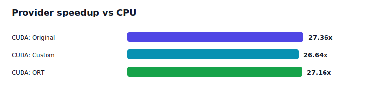

# Vast GPU Run

This run verifies that the workbench can execute on a rented NVIDIA GPU
instance while keeping the benchmark claims narrow and reproducible.

## Machine

- GPU: NVIDIA RTX PRO 6000 Blackwell Workstation Edition
- Driver: 590.48.01
- GPU memory: 97887 MiB
- OS: Linux 6.8.0-90-generic x86_64
- Python: 3.12.3

## Runtime

- `onnxruntime-gpu==1.26.0`
- `onnx==1.21.0`
- Available ONNX Runtime providers:
  - `TensorrtExecutionProvider`
  - `CUDAExecutionProvider`
  - `CPUExecutionProvider`
- CUDA provider dependencies installed from Python wheels:
  - `nvidia-cublas-cu12==12.9.2.10`
  - `nvidia-cuda-runtime-cu12==12.9.79`
  - `nvidia-cudnn-cu12==9.22.0.52`
  - `nvidia-cufft-cu12==11.4.1.4`
  - `nvidia-curand-cu12==10.3.10.19`

## Root Cause

The original GPU check used the default tiny graph:

- batch: 1
- sequence length: 4
- hidden size: 8
- layers: 1

That graph is useful for compiler-pass tests, but it has too little arithmetic
work to benchmark a GPU. CUDA launch overhead dominates, so a tiny graph can
validate provider compatibility without proving meaningful speed.

The fix is to keep the tiny graph for fast local testing and add a separate
larger `benchmark` preset:

- batch: 8
- sequence length: 128
- hidden size: 256
- feed-forward width: 1024
- layers: 4

The benchmark graph still uses standard ONNX operators, no TensorRT, no custom
fused ops, and no CUDA-only graph rewrites.

## Commands

```bash
python -m tcw export --preset benchmark --out artifacts/benchmark.onnx
python -m tcw analyze artifacts/benchmark.onnx --out reports/benchmark.baseline.json
python -m tcw optimize artifacts/benchmark.onnx \
  --out artifacts/benchmark.opt.onnx \
  --report reports/benchmark.opt.json \
  --sample-inputs artifacts/benchmark.inputs.npz \
  --provider CPUExecutionProvider

CUDA_LIBS=$(find .venv/lib -path "*/nvidia/*/lib" -type d | paste -sd: -)
LD_LIBRARY_PATH="$CUDA_LIBS:${LD_LIBRARY_PATH:-}" \
python -m tcw benchmark \
  artifacts/benchmark.onnx artifacts/benchmark.opt.onnx artifacts/benchmark.opt.ort.onnx \
  --labels Original Custom ORT \
  --sample-inputs artifacts/benchmark.inputs.npz \
  --providers CPUExecutionProvider CUDAExecutionProvider \
  --out reports/benchmark.vast.json \
  --warmup 10 \
  --runs 50
```

## Result



| Graph | Nodes | CPU p50 | CUDA p50 | CUDA speedup vs CPU | Max output diff | Parity |
|---|---:|---:|---:|---:|---:|---|
| Original | 204 | 14.020 ms | 0.512 ms | 27.36x | 0 | true |
| Custom rewrites | 192 | 13.741 ms | 0.516 ms | 26.64x | 0 | true |
| ORT optimized | 124 | 13.998 ms | 0.515 ms | 27.16x | 0 | true |

The CUDA rows record `CUDAExecutionProvider` as an effective session provider:

```text
["CUDAExecutionProvider", "CPUExecutionProvider"]
```

This is a provider benchmark on a deterministic transformer-like ONNX graph,
not an end-to-end model deployment benchmark. The result shows that the
workbench can generate a larger graph, validate standard-ONNX rewrites, measure
CPU and CUDA providers, and report cross-provider speedup without hiding CPU
fallback.

Full JSON: [`reports/benchmark.vast.json`](../reports/benchmark.vast.json)

## Tiny Graph Compatibility Check

The tiny graph was also validated under `CUDAExecutionProvider` with exact
output parity. It remains intentionally small so unit tests and the default
workflow are fast on macOS/CPU.

Full JSON: [`reports/validate.cuda.json`](../reports/validate.cuda.json)
