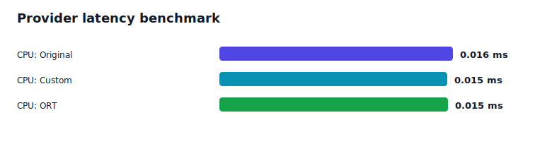

# Transformer Compiler Workbench Report

This report is CPU-first. It does not claim GPU or CUDA validation.

## Graph Summary

| Graph | Nodes | Cast | Transpose | Reshape | CPU latency p50 | Max output diff |
|---|---:|---:|---:|---:|---:|---:|
| Original | 51 | 0 | 3 | 0 |  | 0 |
| ORT optimized | 31 | 0 | 1 | 12 | 0.015 ms | 0 |
| Custom optimized | 48 | 0 | 1 | 0 | 0.016 ms | 0 |

## Provider Benchmark

| Provider | Graph | Effective provider | p50 latency | Speedup vs first graph | Parity vs first graph |
|---|---|---|---:|---:|---|
| CPUExecutionProvider | Original | True | 0.016 ms | 1.00x | True |
| CPUExecutionProvider | Custom | True | 0.015 ms | 1.02x | True |
| CPUExecutionProvider | ORT | True | 0.015 ms | 1.02x | True |

## Rewrite Passes

- `remove_identity`: 1 rewrite(s)
- `remove_dropout_inference`: 0 rewrite(s)
- `collapse_cast_chains`: 0 rewrite(s)
- `collapse_transpose_pairs`: 1 rewrite(s)
- `remove_noop_reshape`: 0 rewrite(s)

## Optimization Opportunities

- Remove Identity nodes when outputs are rewired safely.
- Cancel adjacent Transpose pairs when permutations invert.
- Report-only: MatMul + Add can feed future linear fusion passes.
- Report-only: MatMul + Add + GELU-like regions can feed future MLP fusion passes.
- Report-only: GELU-like regions can feed future activation fusion.
- Report-only: LayerNorm-like subgraphs can feed canonicalization.

## Output Parity

- Standalone validation parity: True
- ORT parity: True
- Custom parity: True

## ONNX-MLIR Lowering

- Status: skipped
- Reason: onnx-mlir binary not found on PATH

## Report Files

- `reports/assets/benchmark_latency.svg`
- `reports/assets/node_counts.svg`
- `reports/assets/ort_op_delta.svg`
- `reports/assets/pass_effects.svg`
- `reports/assets/pipeline.svg`
- `reports/baseline.json`
- `reports/baseline.md`
- `reports/benchmark.json`
- `reports/index.md`
- `reports/lowering.json`
- `reports/opt.json`
- `reports/validate.cuda.json`
- `reports/validate.json`
